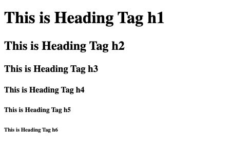
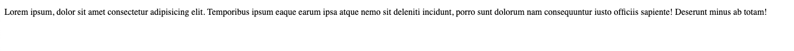

[](#)

> I'm Zaw Linn Tun a Frontend Web Developer on [Zawlinn - Vlog](https://www.youtube.com/@zawlinn-vlog). :heart:

<br>

## Projects &mdash;

<!--  -->

What I use packages are &mdash;

[](https://skillicons.dev)

<br>

## HTML - HyperText Markup Language &mdash;

HTML ဆိုတာ Markup Language တစ်ခုဖြစ်ပီး Website ရဲ့ Structure ပိုင်းအတွက် အဓိကထားပြီး အသုံးပြုသော Language တစ်ခုဖြစ်ပါတယ်။

### Website အမျိုးအစားများ &mdash;

Webstite အမျိုးအစားကို နှစ်မျိုးသတ်မှတ်နိုင်ပါတယ်။

1. Static Website
2. Dynamic Website

## Static Website &mdash;

Static Website ဆိုတာ ကြေငြာသဘော infomation တွေကို show ပြချင်ရုံသက်သက်ရေးဆွဲထားသော Website ဖြစ်ပါတယ်။

## Dynamic Website &mdash;

Dynamic Website ဆိုတာကော User နှင့် interactive ဖြစ်ပီး Data များကို သိမ်းဆည်းခြင်း၊ ပြန်လည်ထုတ်ပေးခြင်းတို့ ပြုလုပ်ပေးနိုင်သော Website အမျိုးအစားပဲ ဖြစ်ပါတယ်။

### How Many Devs &mdash;

1. Frontend Dev
2. Backend Dev
3. Full-stack Dev

### Frontend Dev

frontend dev ကတော့ UI/UX Design ပိုင်းကို အဓိကထားလုပ်ဆောင်ပေးရပါတယ်။ Design tools တွေ color theory တွေနဲ့ Design concept တွေကို ကောင်းကောင်းနားလည်ထားမို့ လိုအပ်ပါတယ်။

### Backend Dev

backend dev တွေကတော့ database နဲ့ Content Management System (CMS) ပိုင်းကို ကောင်းမွန်စွာကျွမ်းကျင်တတ်မြောက်ထားမို့လိုအပ်ပါတယ်။ php, nodejs, asp.net နဲ့ java တို့အပြင် အခြားသော backend မှာ အသုံးပြုတဲ့ programming များစွာရှိပါတယ်။

### Full-Stack Dev

full-stack dev ဆိုတာ frontend dev နဲ့ backend dev နှစ်ခုစလုံးကို ပေါင်းစပ်ပြီး လုပ်ကိုင်နိုင်သူတွေကို ခေါ်ဆိုတာ ဖြစ်ပါတယ်။

## HTML — HyperText Markup Language

HTML ဆိုတာ document တစ်ခုကို တည်ဆောက်နိုင်မို့ အတွက် အသုံးပြုတဲ့ language တစ်ခုပဲဖြစ်ပါတယ်။ Heading, Paragraph, Lists, Table တွေအပြင် Hyperlink တွေကို တည်ဆောက်ပေးနိုင်ပါတယ်။ တည်ဆောက်ထားသော document တွေကို network ပေါ် share နိုင်ရန်အတွက် http protocol (HyperText transfer protocol) နှင့် browser ကိုအသုံးပြု ကြပါတယ်။

### HTML — Heading Tags

HTML မှာ Heading Tag ၆ခု define လုပ်ထားပါတယ်။ H1 to H6 ဖြစ်ပြီး H1 က အကြီးဆုံး tag ဖြစ်၍ H6 က အသေးဆုံး tag တစ်ခုပဲ ဖြစ်ပါတယ်။

```html
<h1>This is Heading Tag h1</h1>
<h2>This is Heading Tag h2</h2>
<h3>This is Heading Tag h3</h3>
<h4>This is Heading Tag h4</h4>
<h5>This is Heading Tag h5</h5>
<h6>This is Heading Tag h6</h6>
```

output &mdash;



### HTML — Paragraph Tag

Paragraph တွေကို တည်ဆောက်နိုင်ရင် HTML မှာ `<p>` လေးရှိပါတယ်။

```html
<p>
  Lorem ipsum, dolor sit amet consectetur adipisicing elit. Temporibus ipsum
  eaque earum ipsa atque nemo sit deleniti incidunt, porro sunt dolorum nam
  consequuntur iusto officiis sapiente! Deserunt minus ab totam!
</p>
```

output &mdash;



[](#)

📫 Reach me out!

[](https://facebook.com/saram.info)
[](https://youtube.com/@zawlinn-vlog)
[](mailto:zawlinn.profile@gmail.com)

<!-- TODO: Add last video link -->

<details>
    <summary>
        My Portfolio
    </summary>
    <br/>

- :earth_asia: I’m currently working at @Mae Sot Market as a sale staff
- :computer: Most used line of code git commit -m "Initial Commit"
- :brain: I’m looking for help with Outstanding Video ideas.
- :mailbox_with_mail: How to reach me: zawlinn.profile@gmail.com.
- :heart: In a relationship with React
</details>
