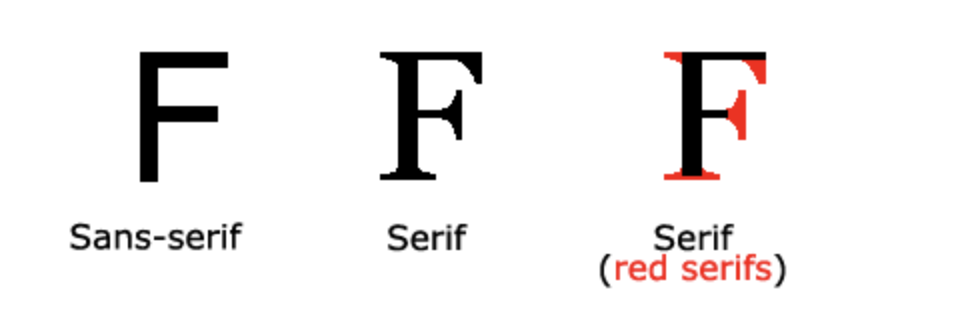

[](#)

> I'm Zaw Linn Tun a Frontend Web Developer on [Zawlinn - Vlog](https://www.youtube.com/@zawlinn-vlog). :heart:

<br>

## Projects &mdash;

<!--  -->

What I use packages are &mdash;

[](https://skillicons.dev)

<br>

## CSS - Border &mdash;

CSS Border မှာ

1. Border width
2. Border style - required
3. Border color (name, rgb/rgba, hsl/hsla, hexa)

### CSS - Border Style &mdash;

- solid - Default
- dotted
- dashed
- double
- groove
- ridge
- inset
- outset
- none
- hidden

### Shorthand

```scss
border: width style color;
```

## CSS - List &mdash;

- list-style-type
- list-style-position - inside, outside
- lsit-style-image

### List - Style

| Value                | Description                                                  |
| -------------------- | ------------------------------------------------------------ |
| disc                 | Default value. The marker is a filled circle                 |
| armenian             | The marker is traditional Armenian numbering                 |
| circle               | The marker is a circle                                       |
| cjk-ideographic      | The marker is plain ideographic numbers                      |
| decimal              | The marker is a number                                       |
| decimal-leading-zero | The marker is a number with leading zeros (01, 02, 03, etc.) |
| georgian             | The marker is traditional Georgian numbering                 |
| hebrew               | The marker is traditional Hebrew numbering                   |
| hiragana             | The marker is traditional Hiragana numbering                 |
| hiragana-iroha       | The marker is traditional Hiragana iroha numbering           |
| katakana             | The marker is traditional Katakana numbering                 |
| katakana-iroha       | The marker is traditional Katakana iroha numbering           |
| lower-alpha          | The marker is lower-alpha (a, b, c, d, e, etc.)              |
| lower-greek          | The marker is lower-greek                                    |
| lower-latin          | The marker is lower-latin (a, b, c, d, e, etc.)              |
| lower-roman          | The marker is lower-roman (i, ii, iii, iv, v, etc.)          |
| none                 | No marker is shown                                           |
| square               | The marker is a square                                       |
| upper-alpha          | The marker is upper-alpha (A, B, C, D, E, etc.)              |
| upper-greek          | The marker is upper-greek                                    |
| upper-latin          | The marker is upper-latin (A, B, C, D, E, etc.)              |
| upper-roman          | The marker is upper-roman (I, II, III, IV, V, etc.)          |

### List - Image

```scss
list-style-image: url();
```

## CSS - Background &mdash;

1. background-color - name, Hex, rgb/rgba, hsl/hsla
2. background-image - images, gradient-color (linear, radial and conic)
3. background-repeat - no-repeat, repeat-x, repeat-y
4. background-size - cover,contain, percentage, px
5. background-attachment - scroll, fix
6. background-position - left/right/top/bottom center(center is optional), lef/right top, left/right bottom
7. background-origin - content-box, border-box, padding-box(default)

## Shortcut &mdash;

```scss
background: color image position/size repeat attachment origin clip;
```

## CSS - Font &mdash;

1. `Serif fonts` - have a small stroke at the edges of each letter. They create a sense of formality and elegance.
2. `Sans-serif fonts` - have clean lines (no small strokes attached). They create a modern and minimalistic look.
3. `Monospace fonts` - here all the letters have the same fixed width. They create a mechanical look.
4. `Cursive fonts` - imitate human handwriting.
5. `Fantasy fonts` - are decorative/playful fonts.

## Font Design &mdash;



### Fellback Font

```scss
p {
  font-family: Tahoma, Verdana, sans-serif;
}
```

> we list three fonts: Tahoma, Verdana, and sans-serif. The second and third fonts are backup fonts, in case the first one is not found:

### Web Safe Fonts for HTML and CSS

The following list are the best web safe fonts for HTML and CSS:

- Arial (sans-serif)
- Verdana (sans-serif)
- Tahoma (sans-serif)
- Trebuchet MS (sans-serif)
- Times New Roman (serif)
- Georgia (serif)
- Garamond (serif)
- Courier New (monospace)
- Brush Script MT (cursive)

## Font Style &mdash;

font-style -

- normal - The text is shown normally
- italic - The text is shown in italics
- oblique - The text is "leaning" (oblique is very similar to italic)

## Font Weight &mdash;

font-weight -

- normal - This is default. Defines normal characters
- bold - Defines thick characters
- bolder - Defines thicker characters
- lighter - Defines lighter characters
- 100-900 - Defines from thin to thick characters. 400 is the same as normal, and 700 is the same as bold

## Font Size &mdash;

font-size

### Absolute sizes:

- px: Pixels offers fixed and precise control over the font size.
- xx-small, x-small, small, medium, large, x-large, xx-large. These keywords has a predefined set of sizes in browsers.

### Relative sizes:

- em: This unit is relative to the font size of the parent element.
- rem: This unit is relative to the font size of the root HTML element.
- %: This unit is relative to the font size of the parent element
- smaller and larger: These units adjust the font size relative to the parent element.

### How to Pick the Right Unit?

- For fixed and precise control, px can be used.
  With px, the web page will not scale well on different screen sizes or with user preferences.
- Absolute size can be useful when the physical size of the output is known.
- For scalable web designs, use em or rem; they allow users to adjust text size in their browser settings.
- Percentage (%) can be useful for adjusting font sizes based on parent elements.

## The vw Unit

- The font size can also be set with the vw unit, which means the "viewport width".

- The vw unit is a relative unit that represents a percentage of the width of the viewport.

- 1vw = 1% of the current width of the browser's viewport. So, if the viewport is 500px wide, 1vw is 5px.

- This way the text size will follow the size of the browser window:

## Font Pairing Rules

Great font pairings are essential to great design!

Here are some basic rules to create great font pairings:

### Complement

It is always safe to find font pairings that complement one another.

A great font combination should harmonize, without being too similar or too different.

### Use Font Superfamilies

A font superfamily is a set of fonts designed to work well together. So, using different fonts within the same superfamily is safe.

For example, the Lucida superfamily contains the following fonts: Lucida Sans, Lucida Serif, Lucida Typewriter Sans, Lucida Typewriter Serif and Lucida Math.

### Contrast is King

Two fonts that are too similar will often conflict. However, contrasts, done the right way, brings out the best in each font.

Example: Combining serif with sans serif is a well known combination.

A strong superfamily includes both serif and sans serif variations of the same font (e.g. Lucida and Lucida Sans).

### Choose Only One Boss

One font should be the boss. This establishes a hierarchy for the fonts on your page. This can be achieved by varying the size, weight and color.

1. Use the "Georgia" font for headings, and "Verdana" for text:

2. Helvetica and Garamond is another classic combination that uses web safe fonts:

3. Use the "Merriweather" font for headings, and "Open Sans" for text:

4. Use the "Ubuntu" font for headings, and "Lora" for text:

5. Use the "Abril Fatface" font for headings, and "Poppins" for text:

6. Use the "Cinzel" font for headings, and "Fauna One" for text:

7. Use the "Fjalla One" font for headings, and "Libre Baskerville" for text:

8. Use the "Space Mono" font for headings, and "Muli" for text:

9. Use the "Spectral" font for headings, and "Rubik" for text:

10. Use the "Oswald" font for headings, and "Noto Sans" for text:

- font-style
- font-variant - small-caps, normal
- font-weight
- font-stretch
- font-size
- line-height
- font-family

### Shortcut

```scss
font: size variant weight stretch size/line-height family;
```

## Install Font on Website &mdash;

```scss
@font-face {
  font-family: "name"; // you can type any name
  src: url("path of font");
}
```

## Install font by CDN (Content Delivery Network)

1. Go to `Google`
2. Search `google fonts`
3. Search font what you want
4. Press `Get Font`
5. Press `Get embed code`
6. Select `@import` - for css file

   Select `<link>` - for HTML file

7. Press `Copy code`

```scss
  <style>
@import url('https://fonts.googleapis.com/css2?family=Lato:ital,wght@0,100;0,300;0,400;0,700;0,900;1,100;1,300;1,400;1,700;1,900&display=swap');
</style>
```

or

```html
<link rel="preconnect" href="https://fonts.googleapis.com" />
<link rel="preconnect" href="https://fonts.gstatic.com" crossorigin />
<link
  href="https://fonts.googleapis.com/css2?family=Lato:ital,wght@0,100;0,300;0,400;0,700;0,900;1,100;1,300;1,400;1,700;1,900&display=swap"
  rel="stylesheet"
/>
```

<br/>

[](#)

📫 Reach me out!

[](https://facebook.com/saram.info)
[](https://youtube.com/@zawlinn-vlog)
[](mailto:zawlinn.profile@gmail.com)

<!-- TODO: Add last video link -->

<details>
    <summary>
        My Portfolio
    </summary>
    <br/>

- :earth_asia: I’m currently working at @Mae Sot Market as a sale staff
- :computer: Most used line of code git commit -m "Initial Commit"
- :brain: I’m looking for help with Outstanding Video ideas.
- :mailbox_with_mail: How to reach me: zawlinn.profile@gmail.com.
- :heart: In a relationship with React
</details>
